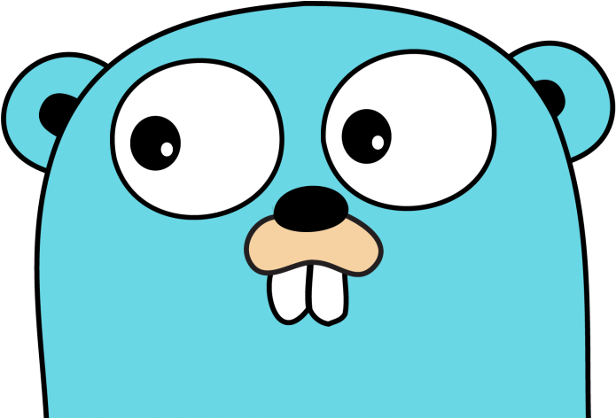

###  Hi there

I'm **Felipe Avelar** and I'm working as **Fullstack Developer @ SWORDHealth**. Currently I'm coding in **Go**, but I already coded in **Python**, **Typescript**, **Java** and others.

[![Linkedin: Felipe Avelar][1]][2]
[![Mail: felipe.avelar@outlook.com][5]][6]

[![Felipe Avelar's SO-PT stats][3]][4]

- 🔭 I’m currently working on as a *Fullstack Developer* @ SWORDHealth
- 🌱 I’m currently learning what I can about _DevOps_
- 👯 I’m looking to collaborate on *open source* projects
- ⚡ Fun fact: I am a huge fan of _Board Games_ and _Golf Puzzles_

[1]: https://img.shields.io/badge/-Felipe%20Avelar-blue?style=flat-square&logo=Linkedin&logoColor=white&link=https://www.linkedin.com/in/felipeavelar/
[2]: https://www.linkedin.com/in/felipeavelar/
[3]: https://pt.stackoverflow.com/users/flair/1333.png?theme=dark
[4]: https://pt.stackoverflow.com/users/1333/felipe-avelar
[5]: https://img.shields.io/badge/-felipe.avelar@outlook.com-004296?style=flat-square&logo=microsoftoutlook&logoColor=white&link=mailto:felipe.avelar@outlook.com
[6]: mailto:felipe.avelar@outlook.com
